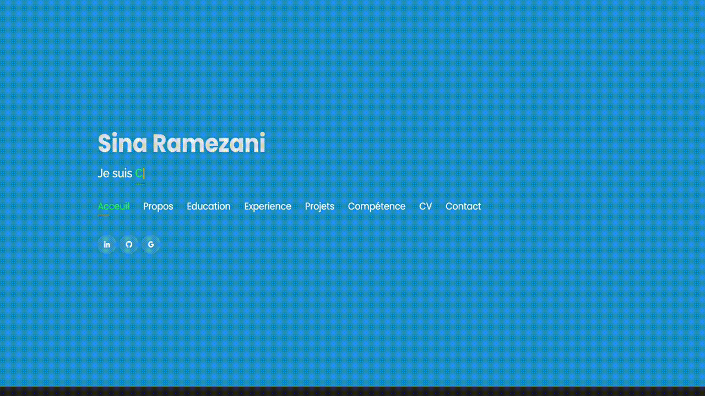

# Portfolio de Sina 🔥
> https://sina-glitch.github.io/Portfolio-de-Sina/

:star: Follow moi sur GitHub !

### Website Preview
#### Page d'Acceuil

#### Page A Propos

#### Projects Page
<!--  -->
  

## Les parties 📚
✔️ A propos\
✔️ Mes centre d'interet\
✔️ Education\
✔️ Experience\
✔️ Projets \
✔️ Competence \
✔️ CV \
✔️ Contact Info

- **[MIT license](http://opensource.org/licenses/mit-license.php)**
